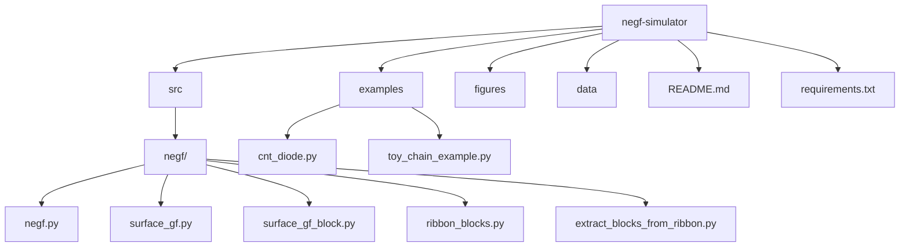
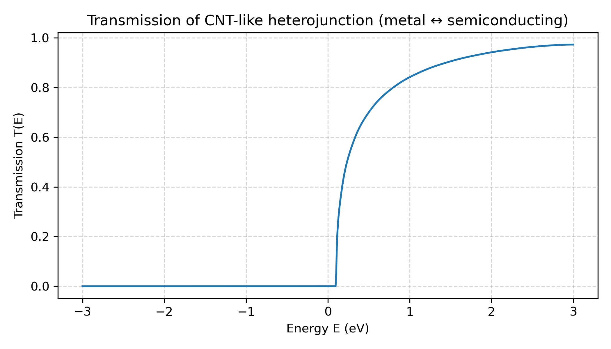
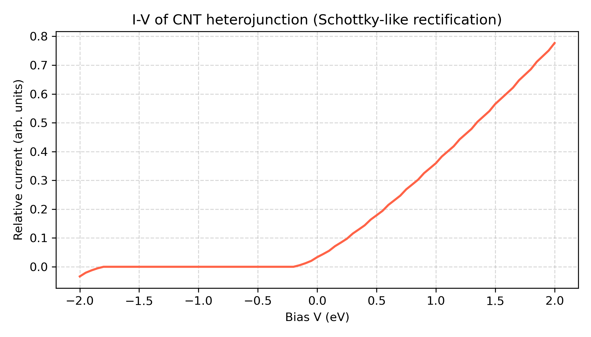
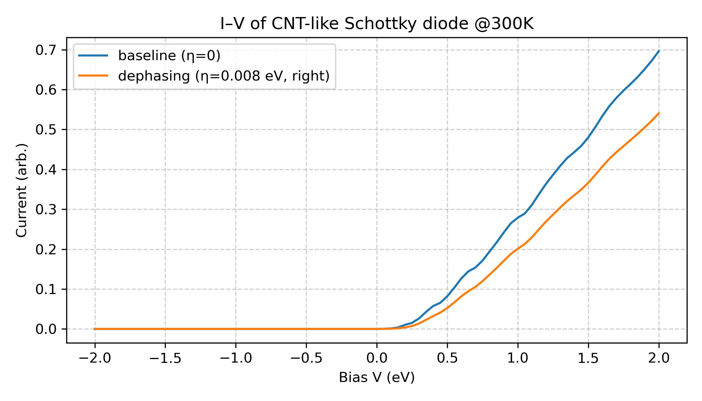

# NEGF Quantum Transport Simulator

A transparent, research-oriented Python toolkit for simulating quantum electron transport using the Non‑Equilibrium Green’s Function (NEGF) formalism.  
Supports **1D chains**, **graphene-like ribbons**, and **CNT heterojunctions**, enabling customizable, reproducible, research‑ready simulations.

---

## Motivation & Purpose

Nano‑electronic devices—graphene nanoribbons, CNT diodes, and engineered heterostructures—are fundamentally governed by **quantum‑coherent transport**.  
Existing NEGF implementations are often:

- computationally heavy or tied to DFT packages,  
- opaque black‑boxes that are difficult to modify,  
- or too complex for rapid prototyping and conceptual studies.

This project addresses these limitations by providing a minimal, fully transparent NEGF framework where every step is accessible:

- Hamiltonian construction  
- Surface Green’s functions  
- Contact self‑energies  
- Retarded/advanced Green’s functions  
- Transmission spectra and I–V characteristics  

This structure makes the toolkit ideal for reproducible research, teaching, and device‑concept exploration.

---

## Key Features

- **Analytic surface Green’s functions** for semi‑infinite tight‑binding leads  
- **Custom heterojunction construction** (metal/semiconductor segments)  
- **Landauer–Büttiker transport calculations**, including:  
  - Transmission **T(E)**  
  - I–V characteristics under asymmetric contact potentials  
- **Parameter sweeps** for device-level insight  
- Tools for exploring:  
  - Fabry–Pérot interference  
  - Kronig–Penney periodic potentials  
  - Geometry‑dependent conduction mechanisms  

---

## Repository Structure

```
negf-simulator/
│
├── src/
│   └── negf/
│       ├── negf.py
│       ├── surface_gf.py
│       ├── surface_gf_block.py
│       ├── ribbon_blocks.py
│       ├── extract_blocks_from_ribbon.py
│       └── __init__.py
│
├── examples/
│   ├── cnt_diode.py
│   ├── toy_chain_example.py
│   └── fabry_perot_chain.py
│
├── figures/
├── data/
├── README.md
└── requirements.txt
```

---

## Architecture Diagram (Mermaid)



---

## NEGF Calculation Flow

```
          ┌────────────────────────┐
          │   Define Hamiltonian   │
          └─────────────┬──────────┘
                        │
                        ▼
        ┌────────────────────────────────┐
        │ Compute surface GFs: Σ_L, Σ_R  │
        └────────────────┬───────────────┘
                         │
                         ▼
             ┌──────────────────────┐
             │  Retarded GF G^r(E)  │
             └──────────┬───────────┘
                        │
                        ▼
          ┌─────────────────────────────────┐
          │   Broadening matrices Γ_L, Γ_R  │
          └──────────────────┬──────────────┘
                             │
                             ▼
       ┌────────────────────────────────────────┐
       │ Transmission: T(E)=Tr(Γ_L G^r Γ_R G^a) │
       └───────────────────┬────────────────────┘
                           │
                           ▼
        ┌──────────────────────────────────────┐
        │ Integrate T(E) → I–V Characteristics │
        └──────────────────────────────────────┘
```

---

## Getting Started

### Install

```bash
pip install -r requirements.txt
pip install -e .
```

### Run Example

```bash
python examples/cnt_diode.py
```

This script produces:

- `TE_spectrum.png`, `TE_spectrum.csv`  
- `IV_curve.png`, `IV_curve.csv`

---

## Minimal Working Example (MWE)

```python
from negf.negf import transmission
from negf.surface_gf import surface_gf_1d
import numpy as np

N = 5
t = -3.0
eps0 = 0.0

Hc = np.zeros((N, N), dtype=complex)
for i in range(N):
    Hc[i, i] = eps0
    if i < N - 1:
        Hc[i, i+1] = Hc[i+1, i] = t

E = np.linspace(-6, 6, 400)
SigmaL = surface_gf_1d(E, eps0, t)
SigmaR = surface_gf_1d(E, eps0, t)

T = transmission(E, Hc, SigmaL, SigmaR)
```

---

## Example Results

### Transmission spectrum of CNT-like heterojunction  


---

### I–V characteristics: baseline vs dephasing  


---

### Dephasing comparison (η = 0 vs η = 0.008)  


---

## Research Value

This toolkit was originally developed to explore transport phenomena such as:

- rectification mechanisms in CNT heterojunctions  
- resonance behavior and Fabry–Pérot–like oscillations  
- asymmetry induced by contact or potential profiles  
- dephasing-driven broadening and suppression of transmission

It has since been reorganized into a clean and modular structure designed for:

- transparent and reproducible transport simulations  
- rapid prototyping of quantum device concepts  
- educational demonstrations of NEGF methodology  
- exploratory modeling and hypothesis testing in nanoscale electronics  

---

## License

This project is released under the **MIT License**, a permissive open-source license that permits reuse, modification, and distribution with attribution.
