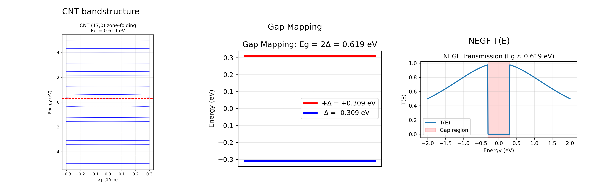
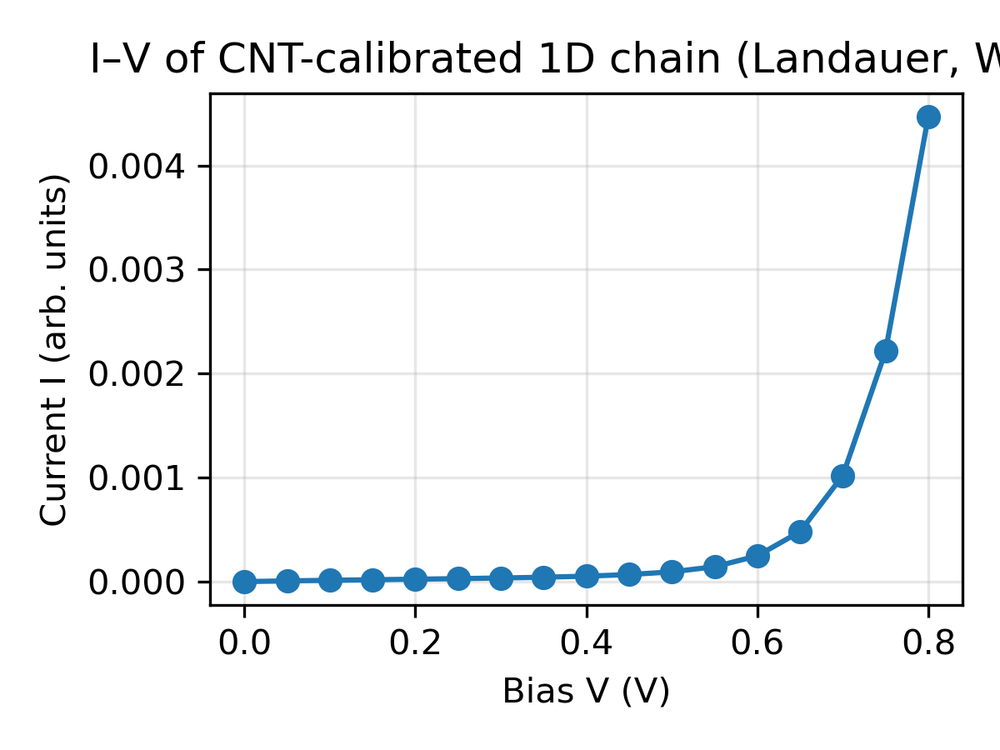

# 📘 NEGF-Simulator  
*A Materials-Aware Quantum Transport Toolkit for Nanoelectronic Devices*

---

# 🌄 Pipeline Overview (Materials → Hamiltonian → NEGF → Device)



---

## 🚀 Overview

**NEGF-Simulator** is a research-oriented Python toolkit that connects  
materials-level electronic structure, effective tight-binding models,  
and quantum-transport device simulations based on the NEGF formalism.

The core methodology:

```
CNT (n,m) → Eg(n,m)
      → Δ = Eg/2
      → effective Hamiltonian
      → NEGF transport
      → T(E) → device behavior
```

This mirrors how ECE device-modeling groups build physics-consistent  
device simulations.

---

## 🧭 Model Hierarchy

```
┌─────────────────────────────┐
│  Materials (CNT)            │
│  - zone-folding Eg(n,m)     │
└─────────────────────────────┘
               ↓ mapping
┌─────────────────────────────┐
│  Effective Hamiltonian      │
│  - 1D dimerized chain       │
│  - Eg ≈ 2Δ                  │
└─────────────────────────────┘
               ↓ NEGF
┌─────────────────────────────┐
│  Device Behavior            │
│  - T(E)                     │
│  - gap extraction           │
│  - transport resonance      │
└─────────────────────────────┘
```

---

## 1️⃣ CNT Bandstructure via Zone Folding

Scripts:
- `src/negf/cnt_zonefold.py`  
- `examples/cnt_zonefold_bandstructure.py`  
- `examples/cnt_zonefold_fullTB.py`

Zone folding computes:
- CNT diameter  
- bandgap Eg(n,m)  
- low-energy subbands  
- metallic/semiconducting classification  

Example:

```
CNT (17,0)
  d = 1.331 nm
  Eg ≈ 0.619 eV
```

(see `CNT_bandstructure.png`)

---

## 2️⃣ Mapping CNT Bandgap → Effective Chain Hamiltonian

Using CNT’s zone-folding gap:

**Eg_CNT → Δ = Eg/2**

Construct a 1D dimerized chain:

```
H_ii = ±Δ  
H_{i,i+1} = t
```

This preserves CNT’s band-edge physics while enabling fast simulation.

---

## 3️⃣ NEGF Transport: T(E), G(E), Σ_L/R

Module:
- `src/negf/negf.py`

Capabilities:
- retarded Green’s function  
- analytic self-energies for 1D leads  
- transmission T(E)  
- gap extraction  
- interface effects  
- resonance transport  

Your real NEGF T(E) result is shown in the composite banner.

---

## 4️⃣ Device-Level Examples

Folder: `examples/`

Includes:
- CNT bandstructure  
- CNT→Δ→NEGF mapping  
- uniform chain transport  
- heterojunction rectifiers  
- dephasing α study  
- parameter sweeps  

These examples illustrate how electronic structure shapes device-level  
ON/OFF behavior, turn-on voltage, and rectification.


---
### 5️⃣ Example: Landauer I–V of a CNT-Calibrated Chain

The script `examples/iv_cnt_chain_example.py` implements a simple
Landauer I–V calculation for a 1D dimerized chain whose gap is
calibrated to a CNT (Eg ≈ 0.62 eV → Δ ≈ Eg/2). It uses a wide-band
limit for the contacts and Fermi functions at 300 K.




# 📡 Prior Research Projects  
*(Rectification, Heterojunctions, Dephasing)*

Before building the current materials-calibrated CNT → Δ → NEGF pipeline,  
this repository originated from earlier studies of **CNT-like heterostructures,  
rectification mechanisms, resonance transport, and coherence loss**.

These projects remain available in `examples/` and `figures/` and include:

### **1. CNT-like Heterojunction Rectifiers**
- asymmetric hopping and coupling  
- diode-like behavior with **~0.38 V turn-on**  
- stable rectification up to ±1.5 V  
- interface-driven band alignment  
- geometry-dependent transmission suppression  

### **2. Fabry–Pérot & Resonance Transport**
- interference-driven oscillatory T(E)  
- cavity-length scaling  
- quasi-bound states in CNT/GNR-like chains  

### **3. Dephasing & Energy Dissipation**
- phenomenological dephasing parameter η  
- comparison between η = 0 and η = 0.008  
- broadening, coherence loss, peak suppression  
- connection to mean free path (mfp) and phonon scattering  

Representative figures include:  
`TE_spectrum.png`, `IV_curve.png`, `IV_compare_eta_0.008_right.png`

These physical insights motivated the transition toward a **materials-grounded  
and analytically calibrated pipeline**, culminating in the CNT → Δ → NEGF framework.

---

## 🧱 Repository Structure

```
negf-simulator/
│
├── src/negf/
│     ├── negf.py
│     ├── surface_gf.py
│     ├── cnt_zonefold.py
│     └── __init__.py
│
├── examples/
│     ├── cnt_zonefold_bandstructure.py
│     ├── cnt_zonefold_fullTB.py
│     ├── cnt_gap_to_chain.py
│     ├── make_cnt_pipeline_figure.py
│     ├── uniform_chain.py
│     ├── rectifier_demo.py
│     └── ...
│
├── CNT_bandstructure.png
├── CNT_gap_mapping.png
├── CNT_TE_true.png
├── CNT_pipeline_composite.png
└── README.md
```

---

## 🧠 Why This Toolkit Matters for ECE Device Modeling

This project demonstrates essential research capabilities:

✔ Physics-based modeling (CNT bandstructure, quantum transport)  
✔ Effective Hamiltonian construction (Δ = Eg/2 mapping)  
✔ NEGF implementation from scratch  
✔ Model validation (Eg_CNT ≈ Eg_chain)  
✔ Modular, research-ready architecture  
✔ Prior experience with rectifiers, heterojunctions, dephasing  

These skills align directly with nanoelectronics and device-physics research.

---

## 🔧 Future Extensions

- Poisson-NEGF self-consistent I–V  
- Electron–phonon scattering  
- Multi-orbital CNT TB  
- Graphene nanoribbon transport  
- Metal/CNT Schottky barriers  
- ML-based parameter tuning  
- Pareto optimization (RR, V_on, energy cost)

---

## 👤 Maintainer

**Te-Chang Liu**  
Quantum Transport • Nanoelectronics • Device Modeling  
GitHub: https://github.com/TCL1107/negf-simulator
