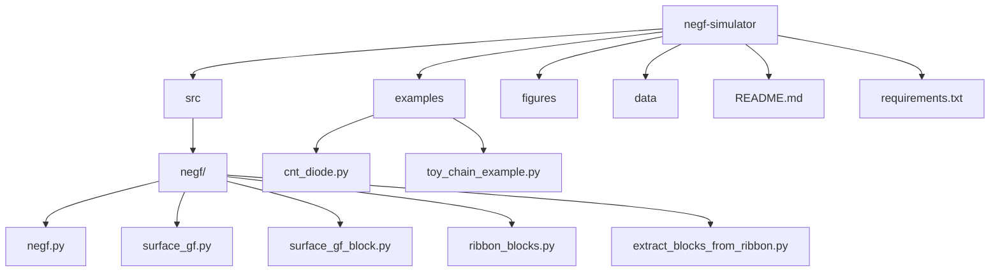

# NEGF Quantum Transport Simulator

A transparent, research-oriented Python toolkit for simulating quantum electron transport using the Non‑Equilibrium Green’s Function (NEGF) formalism.  
Supports **1D chains**, **graphene-like ribbons**, and **CNT heterojunctions**, enabling customizable, reproducible, research‑ready simulations.

---

## Motivation & Purpose

Nano‑electronic devices—graphene nanoribbons, CNT diodes, heterostructures—are fundamentally governed by **quantum‑coherent transport**.  
Existing NEGF implementations are often:

- too heavy or tied to DFT,
- too opaque to modify,
- too complex for rapid prototyping.

**This project fills that gap** by providing a clean, minimal NEGF pipeline where every step is transparent:

- Hamiltonian → surface GF → self‑energies → Green’s functions → transmission → I–V.

This makes it ideal for research, teaching, and hypothesis testing.

---

## Key Features

- Analytic **surface Green’s function** for semi‑infinite tight‑binding leads  
- **Heterojunction construction**: metal/semiconductor segments  
- **Landauer–Büttiker transport**:  
  - Transmission **T(E)**  
  - I–V curves (Schottky-like rectification)  
- **Parameter sweeps** for device‑level design rules  
- Tools for:  
  - Fabry–Pérot interference  
  - Kronig–Penney potentials  
  - Geometry‑dependent conduction  

---

## Repository Structure

```
negf-simulator/
│
├── src/
│   └── negf/
│       ├── negf.py
│       ├── surface_gf.py
│       ├── surface_gf_block.py
│       ├── ribbon_blocks.py
│       ├── extract_blocks_from_ribbon.py
│       └── __init__.py
│
├── examples/
│   ├── cnt_diode.py
│   ├── toy_chain_example.py
│   └── fabry_perot_chain.py
│
├── figures/
├── data/
├── README.md
└── requirements.txt
```

---

## Architecture Diagram (Mermaid)



---

## NEGF Calculation Flow

```
          ┌────────────────────────┐
          │   Define Hamiltonian   │
          └─────────────┬──────────┘
                        │
                        ▼
        ┌────────────────────────────────┐
        │ Compute surface GFs: Σ_L, Σ_R  │
        └────────────────┬───────────────┘
                         │
                         ▼
             ┌──────────────────────┐
             │  Retarded GF G^r(E)  │
             └──────────┬───────────┘
                        │
                        ▼
          ┌─────────────────────────────────┐
          │   Broadening matrices Γ_L, Γ_R  │
          └──────────────────┬──────────────┘
                             │
                             ▼
       ┌────────────────────────────────────────┐
       │ Transmission: T(E)=Tr(Γ_L G^r Γ_R G^a) │
       └───────────────────┬────────────────────┘
                           │
                           ▼
        ┌──────────────────────────────────────┐
        │ Integrate T(E) → I–V Characteristics │
        └──────────────────────────────────────┘
```

---

## Getting Started

### Install

```bash
pip install -r requirements.txt
pip install -e .
```

### Run Example

```bash
python examples/cnt_diode.py
```

Outputs include:

- `TE_spectrum.png`, `TE_spectrum.csv`
- `IV_curve.png`, `IV_curve.csv`

---

## Minimal Working Example (MWE)

```python
from negf.negf import transmission
from negf.surface_gf import surface_gf_1d
import numpy as np

N = 5
t = -3.0
eps0 = 0.0

Hc = np.zeros((N, N), dtype=complex)
for i in range(N):
    Hc[i, i] = eps0
    if i < N - 1:
        Hc[i, i+1] = Hc[i+1, i] = t

E = np.linspace(-6, 6, 400)
SigmaL = surface_gf_1d(E, eps0, t)
SigmaR = surface_gf_1d(E, eps0, t)

T = transmission(E, Hc, SigmaL, SigmaR)
```

---

## Example Results

### Transmission spectrum of CNT-like heterojunction
Shows band-edge opening and transmission suppression due to built‑in asymmetry.


---

### I–V characteristics: baseline vs dephasing
Demonstrates rectification and resonance suppression.


---

### Dephasing comparison (η = 0 vs η = 0.008)
Dephasing smooths nonlinearities and shifts current onset.


---

## Research Value

This toolkit was originally developed for studying:

- CNT heterojunction rectification  
- resonance phenomena  
- transport asymmetry  
- dephasing effects  

It is now cleaned and structured for:

- graduate-level research  
- reproducible device simulations  
- quantum transport education  
- hypothesis testing and model development  

---

## License

MIT License.
